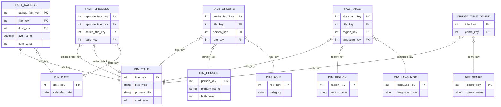

# 🏗️ Dimensional Modeling Practice for Beginner Data Engineers

Welcome!  
This project is a **hands-on pathway** for career shifters and beginner Data Engineers to practice the **end-to-end data engineering workflow**:

- Ingest **raw datasets** using [dlt](https://dlthub.com)  
- Apply **standardization & cleaning** into a `clean` schema  
- Design and implement **dimensional models (star schema / snowflake)** with [dbt](https://docs.getdbt.com/) in a `mart` schema  
- Explore and present **business insights** with [Metabase](https://www.metabase.com/)  

You will work through three datasets of increasing size and complexity:  

1. **Chinook (Music Store sample DB)**  
2. **Open University Learning Analytics (OULAD)**  
3. **IMDb Non-Commercial Datasets**  

---

## 🌟 Introduction: Why Dimensional Modeling?

Dimensional modeling is a database design technique used in data warehousing and BI. Instead of highly normalized OLTP schemas, it uses:

- **Fact tables** – numeric, measurable events (e.g., sales, ratings, interactions).  
- **Dimension tables** – descriptive attributes that provide context (e.g., customer, product, date).  

### Why it matters:
- Makes querying and reporting simpler and faster  
- Provides consistency for analytics teams  
- Helps businesses understand trends and behavior  

### Why it’s valuable for career shifters:
- It’s a **foundational skill** in analytics engineering and BI.  
- Teaches you to think about **business processes, not just tables**.  
- Builds confidence in modern DE workflows (raw → clean → mart → BI).  

---

## 🔄 The 3-Stage Data Pipeline

In this project, you’ll practice a **modern analytics engineering workflow** by moving data through distinct layers:

```mermaid
flowchart LR
  A[Raw Schema] --> B[Clean Schema] --> C[Mart Schema] --> D[Reporting Layer]
````

### 1. **Raw Schema** (Ingestion with dlt)

* **Purpose:** Land the source data as-is.
* **Tools:** [dlt](https://dlthub.com) (Data Load Tool).
* **Activities:**

  * Extract and load CSVs / DB dumps / TSVs.
  * Preserve original structure (no transformations yet).
  * Add minimal metadata (e.g., load time).

### 2. **Clean Schema** (Standardization & Normalization)

* **Purpose:** Make the data reliable and consistent.
* **Tools:** SQL transformations (staging models in dbt).
* **Activities:**

  * Normalize messy structures (explode arrays, split multi-values).
  * Standardize data types (dates, numbers, booleans).
  * Handle nulls and missing values.
  * Apply naming conventions.
* **Outcome:** Data is tidy, consistent, and trustworthy.

### 3. **Mart Schema** (Dimensional Modeling)

* **Purpose:** Design **star schemas** for analytics.
* **Tools:** [dbt](https://docs.getdbt.com/).
* **Activities:**

  * Build **fact tables** (business processes: sales, ratings, interactions).
  * Build **dimension tables** (context: customer, course, title, date).
  * Create bridges for many-to-many relationships (e.g., title–genre).
  * Define surrogate keys and grain explicitly.
* **Outcome:** An **analytics-ready warehouse layer**.

### 🔬 Sandbox Schema

* **Purpose:** Safe space to **prototype and test models** before productionizing them.
* **Tools:** dbt or SQL IDE (DBeaver, VSCode, etc.).
* **Activities:**

  * Experiment with joins, aggregations, and transformations.
  * Validate assumptions about grain, keys, and SCD handling.
  * Once stable, promote to `mart`.

### 📊 Reporting Layer

* **Purpose:** Answer business questions and share insights.
* **Tools:** [Metabase](https://www.metabase.com/).
* **Activities:**

  * Connect to `mart` schema.
  * Build dashboards and reports.
  * Explore themes: customer behavior, trends, retention, demographics, operations.

---

## 🎯 Business Question Themes

Across all exercises, you will explore **six core themes**:

1. **Customer & User Behavior** – Who are the most valuable or engaged?  
2. **Performance Over Time** – How do metrics evolve by month, semester, or year?  
3. **Product / Content Insights** – Which products, courses, or titles perform best?  
4. **Regional / Demographic Trends** – How do cohorts, regions, or groups differ?  
5. **Engagement & Retention** – What drives churn, dropout, or loyalty?  
6. **Operational Effectiveness** – How do staff, processes, or structures affect outcomes?  

---

# 📂 Exercises

---

## 1. [Chinook](https://github.com/lerocha/chinook-database/) (Music Store)

### About the Dataset
- **Domain:** Digital music store (like iTunes).  
- **Size/Complexity:** 1MB, Small, normalized OLTP schema.  
- **Tables:** Customers, Employees, Invoices, Tracks, Albums, Artists, Playlists.  

### Key Instructions
1. Ingest Chinook data into the `raw` schema with dlt.  
2. Apply type casting and null handling into the `clean` schema.  
3. Design a **star schema**:  
   - **Fact:** `FactSales` (from InvoiceLine).  
   - **Dimensions:** Customer, Employee, Track, Album, Artist, Date, Genre, MediaType.  
4. Implement in dbt under the `mart` schema.  
5. Build Metabase dashboards to explore **sales and customer behavior**.  

### Expected Outcomes
- Learn to transform OLTP → dimensional model.  
- Answer questions like:  
  - Who are the top customers by revenue?  
  - Which genres sell best by country?  
- Build your **first BI dashboard**.  

#### Illustrative Star Schema
```mermaid
erDiagram
  FACT_SALES {
    int invoice_line_key PK
    int customer_key FK
    int employee_key FK
    int track_key FK
    int date_key FK
    decimal quantity
    decimal line_amount
  }

  DIM_CUSTOMER { int customer_key PK string full_name string country }
  DIM_EMPLOYEE { int employee_key PK string full_name string title }
  DIM_TRACK { int track_key PK string track_name int album_key int artist_key int genre_key }
  DIM_ALBUM { int album_key PK string album_title }
  DIM_ARTIST { int artist_key PK string artist_name }
  DIM_GENRE { int genre_key PK string genre_name }
  DIM_MEDIATYPE { int mediatype_key PK string media_type }
  DIM_DATE { int date_key PK date calendar_date }

  FACT_SALES }o--|| DIM_CUSTOMER : customer_key
  FACT_SALES }o--|| DIM_EMPLOYEE : employee_key
  FACT_SALES }o--|| DIM_TRACK : track_key
  FACT_SALES }o--|| DIM_DATE : date_key
  DIM_TRACK }o--|| DIM_ALBUM : album_key
  DIM_TRACK }o--|| DIM_ARTIST : artist_key
  DIM_TRACK }o--|| DIM_GENRE : genre_key
  DIM_TRACK }o--|| DIM_MEDIATYPE : mediatype_key
````

---

## 2. [Open University Learning Analytics Dataset](https://archive.ics.uci.edu/dataset/349/open+university+learning+analytics+dataset) (OULAD)

### About the Dataset

* **Domain:** Education analytics (Open University UK).
* **Size/Complexity:** 500MB, Medium (32k students, ~10M VLE interactions).
* **Tables:** Students, registrations, assessments, VLE logs.
* **Features:** Time-series, demographics, missing values.
* More references can be found [here](https://analyse.kmi.open.ac.uk/open-dataset).

### Key Instructions

1. Ingest CSVs into the `raw` schema.
2. Standardize types, handle missing values in the `clean` schema.
3. Design a star schema around **student performance & engagement**:

   * **Facts:** `FactAssessments`, `FactVLEInteractions`.
   * **Dimensions:** Student, Course, Module Presentation, Date, Demographics.
4. Implement in dbt (`mart` schema).
5. Build dashboards in Metabase to analyze **cohorts, dropout risk, and engagement**.

### Expected Outcomes

* Practice handling **larger, messier data**.
* Model both **event-based and aggregated facts**.
* Answer questions like:

  * Do demographics influence dropout?
  * How does engagement in the VLE impact performance?

#### Illustrative Star Schema

```mermaid
erDiagram
  FACT_ASSESSMENT {
    int assessment_fact_key PK
    int student_key FK
    int module_presentation_key FK
    int date_key FK
    decimal score
    string passed_flag
  }

  FACT_VLE_INTERACTIONS {
    int vle_fact_key PK
    int student_key FK
    int module_presentation_key FK
    int date_key FK
    int clicks
  }

  DIM_STUDENT { int student_key PK string gender string age_band string region }
  DIM_MODULE { int module_key PK string module_code string module_name }
  DIM_PRESENTATION { int module_presentation_key PK int module_key string presentation_code }
  DIM_DATE { int date_key PK date calendar_date }

  FACT_ASSESSMENT }o--|| DIM_STUDENT : student_key
  FACT_ASSESSMENT }o--|| DIM_PRESENTATION : module_presentation_key
  FACT_ASSESSMENT }o--|| DIM_DATE : date_key

  FACT_VLE_INTERACTIONS }o--|| DIM_STUDENT : student_key
  FACT_VLE_INTERACTIONS }o--|| DIM_PRESENTATION : module_presentation_key
  FACT_VLE_INTERACTIONS }o--|| DIM_DATE : date_key

  DIM_PRESENTATION }o--|| DIM_MODULE : module_key
```

---

## 3. [IMDb](https://developer.imdb.com/non-commercial-datasets/)  Non-Commercial Datasets

### About the Dataset

* **Domain:** Entertainment (movies, TV, people).
* **Size/Complexity:** Large (~5.5 GB compressed / ~15 GB uncompressed).
* **Files:** Titles, ratings, names, crew, episodes, genres, akas.
* **Challenges:** Many-to-many relationships, arrays, hierarchies (series–season–episode).

### Key Instructions

1. Stage TSVs in `raw` schema.
2. Clean and **explode arrays** (genres, crew, professions) into `clean`.
3. Build a dimensional model:

   * **Facts:** Ratings, Credits, Episodes, Localized Titles.
   * **Dimensions:** Title, Person, Role/Category, Genre, Region, Language, Date.
   * **Bridges:** Title–Genre, Person–Profession.
4. Implement optimized dbt models in `mart`.
5. Build Metabase reports to explore **ratings, genres, careers, and regional trends**.

### Expected Outcomes

* Practice modeling **complex, large-scale datasets**.
* Learn to design **bridges and hierarchies**.
* Answer questions like:

  * Which genres trend in the Philippines?
  * Who are the most prolific directors by ratings?
  * Which TV shows have the most highly-rated episodes?

#### Illustrative Star Schema



---

# ✅ Wrap-Up

By completing these three exercises, you will:

* Understand the **end-to-end DE lifecycle**: raw → clean → mart → BI.
* Gain confidence with **dlt, dbt, and Metabase**.
* Practice dimensional modeling across **increasingly complex domains**.
* Build dashboards that answer **real business questions**.

This journey mirrors real-world work:

* Start small with **Chinook**,
* Handle richer, messier data with **OULAD**,
* Tackle industry-scale complexity with **IMDb**.
* Presenting and documenting your project? Read [this](DOC-GUIDE.md).

Good luck, and happy modeling! 🚀

