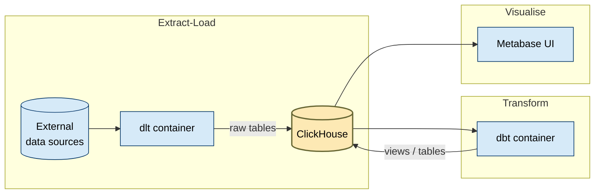

# FTW DE BOOTCAMP

The [For the Women Foundation](https://www.ftwfoundation.org/) Data Engineering Bootcamp delivers six Saturdays of hands-on ELT for 30 scholars. This repo jump-starts your environment so you can focus on concepts and code.

**Bootcamp 6-Week Timeline**
*All sessions are Saturdays, each with a morning lecture (3 hrs) and afternoon lab (3–4 hrs).*

|  Week | Focus                              | Morning Lecture                         | Afternoon Lab                                    |
| :---: | ---------------------------------- | --------------------------------------- | ------------------------------------------------ |
| **1** | Platform & ELT Foundations         | Docker Compose, ClickHouse & dlt basics | Load MovieLens, build dim/fact tables & chart    |
| **2** | SQL Transformations & Modeling     | dbt structure, star schemas, joins      | Ingest NYC Taxi, staging + revenue mart & trends |
| **3** | Incrementals, Streaming & Testing  | dlt incremental/streaming, testing      | NOAA weather stream + station joins & dashboard  |
| **4** | Data Quality & Cleaning Messy Data | SQL cleaning patterns, dbt tests        | Ingest 311 complaints, clean, mart + pulse       |
| **5** | Capstone Kickoff & Pipeline Build  | Capstone briefing & design              | Scaffold dlt + initial dbt staging (team work)   |
| **6** | Capstone Finish & Presentations    | Finalize models, docs & CI              | Build dashboards, pulse; team demos & wrap-up    |

Note: This outline is still in development and is subject to change.

---

## 🚀 Quick Start

1. **Provision** an Ubuntu 22.04 VPS (or local VM)  
2. **Install Docker & Compose**, clone this repo, and connect via VS Code Remote-SSH  
3. **Build** custom images
4. **Run** extract & transform
5. **Open** Metabase at `http://localhost:3001`, add the pre-seeded ClickHouse connection, and start charting.

Everything is containerized, reproducible, and CI-ready—perfect for rapid learning and real-world practice.

---

## 🔄 Pipeline Overview



> **Note:** In production you’d add a data lake (e.g. S3/Delta Lake), data catalog (Amundsen/DataHub), security/Governance (RBAC, encryption, Ranger), orchestration (Airflow/Kubernetes), observability (Prometheus/Grafana), and data quality (Great Expectations). We’ve omitted those to focus on core ELT.

Above all, this bootcamp emphasizes **SQL** with only minimal Python, YAML, and Markdown.

---

## 📊 Server Utilization

> On a server with **15.6 GiB RAM** & a modern multi-core CPU:

### 1. Image Footprint

| Image                          | Tag    |   Size |
| ------------------------------ | ------ | -----: |
| `de-bootcamp-template-dbt`     | latest | 169 MB |
| `de-bootcamp-template-dlt`     | latest | 556 MB |
| `metabase/metabase`            | latest | 864 MB |
| `clickhouse/clickhouse-server` | 23.12  |   1 GB |

> **Total:** ≈ 2.6 GB of images

### 2. Runtime Usage

| Container      |  CPU | Memory             |
| -------------- | :--: | ------------------ |
| **metabase**   | 5.7% | 914 MiB / 15.6 GiB |
| **clickhouse** | 0.6% | 168 MiB / 15.6 GiB |

---

## 🛠 Setup Instructions

To keep all work within a consistent namespace, replace all 'myk' phrases with a unique name.

### A. Provision & Harden the Server

| Step                    | Command / Action                                                                                                         | Notes                           |
| ----------------------- | ------------------------------------------------------------------------------------------------------------------------ | ------------------------------- |
| **A-1. Create VM/VPS**  | Choose Ubuntu 22.04 LTS, 2 vCPU, 4 GB RAM+, open ports 22, 8123, 9000, 3001 (or use SSH tunnel)                          |                                 |
| **A-2. Add admin user** | `bash sudo adduser myk && sudo usermod -aG sudo myk `                                                                    | Don’t use `root` for daily work |
| **A-3. Harden SSH**     | `bash sudo apt update && sudo apt install -y openssh-server git`<br/>Edit `/etc/ssh/sshd_config`: disable password auth… |                                 |
| **A-4. Copy SSH key**   | On **local** machine: `ssh-copy-id myk@<VPS_IP>` or paste into `~/.ssh/authorized_keys`                                  |                                 |

---

### **General SSH Setup Guide for Remote Servers (Linux/macOS/Windows)**  

This guide provides **universal instructions** for setting up SSH access to a remote server (e.g., AWS, DigitalOcean, or a private VM) using:  
✅ **VS Code** (with Remote-SSH)  
✅ **Terminal/PowerShell** (direct SSH)  
✅ **Proper key permissions** (critical for security)  

---

## **Step 1: Generate & Configure SSH Keys**  
### **1.1 Generate a Key Pair (If You Don’t Have One)**  
Run in **terminal/PowerShell**:  
```bash
ssh-keygen -t rsa -b 4096 -f ~/.ssh/my-server-key
```
- Replace `my-server-key` with a descriptive name (e.g., `aws-prod-key`).  
- **Optional**: Add a passphrase for extra security.  

### **1.2 Set Correct Permissions (Linux/macOS)**  
```bash
chmod 600 ~/.ssh/my-server-key      # Private key: ONLY user can read  
chmod 644 ~/.ssh/my-server-key.pub  # Public key: Readable by others  
```

### **1.3 Set Permissions (Windows - PowerShell)**  
```powershell
icacls .\my-server-key /reset
icacls .\my-server-key /inheritance:r
icacls .\my-server-key /grant:r "$($env:USERNAME):(R)" # Powershell
icacls .\my-server-key /grant:r "%USERNAME%:(R)" # Windows Command Prompt
```
*(Prevents "UNPROTECTED PRIVATE KEY FILE" errors.)*  

---

## **Step 2: Add Public Key to the Remote Server**  
### **2.1 Copy Public Key to Server**  
#### **Option A: Using `ssh-copy-id` (Linux/macOS)**  
```bash
ssh-copy-id -i ~/.ssh/my-server-key.pub user@server-ip
```
#### **Option B: Manual Setup (Windows/All OS)**  
1. **Display your public key**:  
   ```bash
   cat ~/.ssh/my-server-key.pub
   ```
2. **On the remote server**, append it to `~/.ssh/authorized_keys`:  
   ```bash
   mkdir -p ~/.ssh
   echo "PASTE_PUBLIC_KEY_HERE" >> ~/.ssh/authorized_keys
   chmod 600 ~/.ssh/authorized_keys  # Restrict permissions
   ```

---

## **Step 3: Configure SSH for Easy Access**  
### **3.1 Edit/Create `~/.ssh/config`**  
```plaintext
Host my-server-alias       # Shortcut name (e.g., "aws-prod")
  HostName 123.45.67.89    # Server IP/Domain
  User ubuntu              # SSH username
  Port 22                  # Default SSH port (change if needed)
  IdentityFile ~/.ssh/my-server-key  # Private key path
  # Optional: Forwarding
  ForwardAgent yes         # For Git over SSH
  LocalForward 8080 localhost:80  # Port forwarding
```
*(Windows users: Use full path like `F:\path\to\key`)*  

### **3.2 Test Connection**  
```bash
ssh my-server-alias  # Should log in without a password!
```

---

## **Step 4: Connect with VS Code (Optional)**  
1. **Install the [Remote - SSH](https://marketplace.visualstudio.com/items?itemName=ms-vscode-remote.remote-ssh) extension**.  
2. **Press `F1` → "Remote-SSH: Connect to Host" → Select `my-server-alias`**.  
3. **Done!** VS Code will open files directly on the remote server.  

---

## **Troubleshooting**  
| Issue | Fix |  
|-------|-----|  
| **"Permissions are too open"** | Run `chmod 600 ~/.ssh/key` (Linux) or `icacls` reset (Windows). |  
| **"Connection refused"** | Check firewall (`ufw allow 22` on Linux) and server IP. |  
| **VS Code won’t connect** | Use `ssh -v my-server-alias` to debug. |  

### **Important Reminders**  
🔹 **Never share private keys (`my-server-key`)**—treat them like passwords!  
🔹 **Use `ssh -v`** for verbose debugging if connections fail.  
🔹 **For AWS/GCP**: Ensure the security group allows inbound SSH (port 22).  

---

### B. Install Docker & Compose

```bash
sudo apt update
sudo apt install -y ca-certificates curl gnupg
sudo install -m0755 -d /etc/apt/keyrings
curl -fsSL https://download.docker.com/linux/ubuntu/gpg \
  | sudo gpg --dearmor -o /etc/apt/keyrings/docker.gpg
echo \
  "deb [arch=$(dpkg --print-architecture) signed-by=/etc/apt/keyrings/docker.gpg] \
   https://download.docker.com/linux/ubuntu $(lsb_release -cs) stable" \
  | sudo tee /etc/apt/sources.list.d/docker.list > /dev/null
sudo apt update
sudo apt install -y docker-ce docker-ce-cli containerd.io docker-buildx-plugin docker-compose-plugin
sudo usermod -aG docker myk   # allow Docker without sudo
newgrp docker                # refresh group
docker version               # verify installation
```

---

### C. VS Code Remote-SSH

1. Install the **Remote – SSH** extension in VS Code.
2. Add to your local `~/.ssh/config`:

   ```sshconfig
   Host ftw-vps
     HostName   <VPS_IP>
     User       myk
     Port       22
     IdentityFile ~/.ssh/id_ed25519
   ```
3. In VS Code: **Remote-SSH: Connect to Host… → ftw-vps**.

---

### D. Clone & Push the Repo

```bash
cd ~
git clone https://github.com/ogbinar/ftw-de-bootcamp.git ftw-de-bootcamp-myk
cd ftw-de-bootcamp-myk

# Point to your GitHub
git remote rename origin upstream
git remote add origin git@github.com:<your_user>/ftw-de-bootcamp.git
git branch -M main

# Tweak compose.yaml / .env if needed
git add .
git commit -m "FTW DE bootcamp setup"
git push -u origin main
```

**Directory structure:**

```text
ftw-de-bootcamp/
├── clickhouse/
│   └── users.d/
│       └── ftw_user.xml
├── compose.yaml
├── dbt/
│   ├── dbt_project.yml
│   ├── Dockerfile
│   ├── models/
│   │   ├── cylinders_by_origin.sql # transformation of auto_mpg dataset
│   │   └── sources.yml
│   └── profiles.yml
├── dlt/
│   ├── clickhouse.yaml
│   ├── Dockerfile
│   ├── requirements.txt
│   ├── mpg_pipeline.py       # individual pipeline: extraction of auto_mpg dataset
└── README.md

```

---

### E. First Run

```bash
# Build images
docker compose -p myk build dlt dbt

# Start stateful services
docker compose -p myk up -d clickhouse --remove-orphans
docker compose -p myk up -d metabase --remove-orphans
docker compose -p myk up -d postgres_chinook --remove-orphans

# Quick ClickHouse sanity check
docker compose -p myk exec clickhouse \
  clickhouse-client --query="SELECT now();"

# Run extract 
docker compose -p myk --profile jobs run --rm --user $(id -u):$(id -g) dlt   python pipelines/dlt-mpg-pipeline.py

# Verify raw data
docker compose -p myk exec clickhouse \
  clickhouse-client --query="SELECT count() FROM auto_mpg___mpg_raw;"


# Run transform
docker compose -p myk --profile jobs run --rm dbt \
  run --models cylinders_by_origin

# Verify model
docker compose -p myk exec clickhouse \
  clickhouse-client --query="SELECT count() FROM cylinders_by_origin;"


> If ports 8123/3001 are firewall-blocked, use VS Code port forwarding.

# advanced exercises

## Ingest from Postgres
### make sure postgres is running
docker compose -p myk --profile jobs run --rm --user $(id -u):$(id -g) dlt   python pipelines/dlt-chinook-pipeline.py

## Timeseries
docker compose -p myk --profile jobs run --rm --user $(id -u):$(id -g) dlt   python pipelines/dlt-meteo-pipeline.py

## Incremental + Cron
docker compose -p myk --profile jobs run --rm --user $(id -u):$(id -g) dlt   python pipelines/dlt-btc-pipeline.py

## Ingest from REST API
docker compose -p myk --profile jobs run --rm --user $(id -u):$(id -g) dlt   python pipelines/dlt-poke-pipeline.py

## Ingest from Webscraping
docker compose -p myk --profile jobs run --rm --user $(id -u):$(id -g) dlt   python pipelines/dlt-laz-pipeline.py
```
---

### F. DBeaver 

1. Install DBeaver locally.
2. Create a **ClickHouse** connection:

   > Host: `clickhouse` Port: `8123` Database: `default`
   > User: `ftw_user` Password: `ftw_pass`
3. Run:

   ```sql
   SELECT count() FROM cylinders_by_origin;
   ```

---

If everything works 

### G. Metabase Setup (One-time)

1. Forward port 3001 in VSCODE
2. Visit **[http://localhost:3001](http://localhost:3001)** (or forwarded port).
3. Complete the wizard, choose **ClickHouse**, enter:

   ```
   clickhouse:8123  •  ftw_user  •  ftw_pass  •  SSL: off
   ```
4. Build a bar chart of **avg\_cyl by origin** and save to **Cars Demo**.

---

## 🔄 Daily Usage

| Goal                          | Command                                                         |
| ----------------------------- | --------------------------------------------------------------- |
| **Start core services**       | `docker compose -p myk up -d clickhouse metabase`               |
| **Run full ELT pipeline**     | `docker compose -p myk --profile jobs up dlt dbt`               |
| **Stream DLT logs**           | `docker compose -p myk logs -f dlt`                             |
| **Shut down (preserve data)** | `docker compose -p myk down -v`                                    |
| **Wipe all volumes**          | `./scripts/reset.sh`                                            |

---

## ⏰ Schedule a Daily Job via cron

1. **Edit your crontab**  
   ```bash
   crontab -e
  ```

2. **Run btc pipeline every minute**:

   ```cron
   * * * * *  /projects/ftw-de-bootcamp/scripts/run-btc-pipeline.sh
   ```

3. **Save and exit**.

   > The pipeline will now execute every minutes, appending stdout & stderr to `ftw-de-bootcamp/logs/dlt-btc-pipeline.log`.

---


## 📝 TODO


* exercises - done
* Develop lecture slides, assignments, pre-lectures / courses to take 
- access isolation
- docker cronjob
- number of pages for laz scrape

---

You’re all set—edit create a new pipeline or dbt model, re-run the jobs, refresh Metabase, and watch new insights appear!
