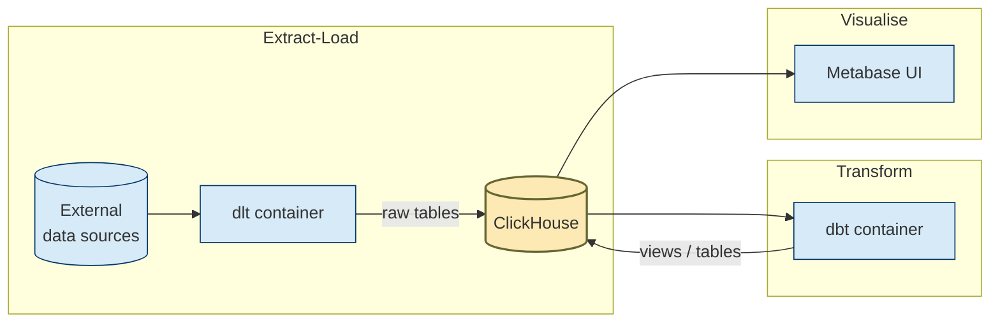

# FTW DE BOOTCAMP

The FTW DE Bootcamp delivers six Saturdays of hands-on data-engineering for 30 scholars.
This repository jump-starts the entire toolchain so you can skip the yak-shaving and dive straight into concepts and code.

It launches a complete analytics stack with **one Compose command**:

* **ClickHouse** – blazing-fast columnar warehouse
* **dlt** – Python-native extract & load
* **dbt** – SQL-first transformations
* **Metabase** – point-and-click dashboards

The workflow is containerised end-to-end:

1. Spin up an Ubuntu 22.04 VPS (or local VM), install Docker, and clone the repo via VS Code Remote-SSH.
2. `docker compose build` creates custom dlt/dbt images and a persistent ClickHouse volume.
3. `docker compose --profile jobs up dlt dbt` loads sample car data and materialises the `cylinders_by_origin` view.
4. Open Metabase at `localhost:3001`, add the pre-seeded ClickHouse connection, and start charting immediately.

Everything is reproducible, CI-ready, and easy to extend with new dlt resources or dbt models—perfect for rapid learning and real-world practice.

### Pipeline overview



---

## A · Provision and harden the server (once)

| Step                          | Command / action                                                                                                                                                                                                   | Notes                                                   |
| ----------------------------- | ------------------------------------------------------------------------------------------------------------------------------------------------------------------------------------------------------------------ | ------------------------------------------------------- |
| **A-1  Create the VM / VPS**  | Choose Ubuntu 22.04 LTS, 2 vCPU, 4 GB RAM+, inbound ports 22 + (8123, 9000, 3001) or use an SSH tunnel later                                                                                                       |                                                         |
| **A-2  Add an admin user**    | `bash sudo adduser myk && sudo usermod -aG sudo myk `                                                                                                                                                              | avoid using *root* for daily work                       |
| **A-3  Harden SSH**           | `sudo apt update && sudo apt install -y openssh-server git`<br>Edit `/etc/ssh/sshd_config`: disable password auth (`PasswordAuthentication no`), change default port if desired, then `sudo systemctl restart ssh` |                                                         |
| **A-4  Copy your public key** | On **local** machine:<br>`ssh-copy-id myk@<VPS_IP>`                                                                                                                                                                | or paste the key into `~/.ssh/authorized_keys` manually |

---

## B · Install Docker & Compose

```bash
# as sudo user on VPS
sudo apt update
sudo apt install -y ca-certificates curl gnupg
sudo install -m 0755 -d /etc/apt/keyrings
curl -fsSL https://download.docker.com/linux/ubuntu/gpg \
     | sudo gpg --yes --dearmor -o /etc/apt/keyrings/docker.gpg
echo \
  "deb [arch=$(dpkg --print-architecture) \
  signed-by=/etc/apt/keyrings/docker.gpg] \
  https://download.docker.com/linux/ubuntu $(lsb_release -cs) stable" \
  | sudo tee /etc/apt/sources.list.d/docker.list > /dev/null
sudo apt update
sudo apt install -y docker-ce docker-ce-cli containerd.io docker-buildx-plugin docker-compose-plugin
sudo usermod -aG docker myk   # use Docker without sudo
newgrp docker                 # activate group immediately
docker version                # sanity-check
```

---

## C · Set up **VS Code Remote SSH**

1. **Install the “Remote - SSH” extension** in VS Code on your laptop.

2. Add an entry to `~/.ssh/config` (local):

   ```sshconfig
   Host ftw-vps
     HostName   <VPS_IP>
     User       myk
     Port       22          # change if you moved SSH
     IdentityFile ~/.ssh/id_ed25519
   ```

3. In VS Code: **⇧ ⌘ P → Remote-SSH: Connect to Host… → ftw-vps**.
   VS Code opens a remote window; a green corner shows you’re inside the VPS.

---

## D · Clone & push the bootcamp repo

```bash
cd ~
git clone https://github.com/ogbinar/ftw-de-bootcamp.git
cd ftw-de-bootcamp

# create an empty repo on YOUR GitHub account (e.g., myuser/ftw-de-bootcamp)
git remote rename origin upstream
git remote add origin git@github.com:<your_user>/ftw-de-bootcamp.git
git branch -M main

# tweak compose ports or passwords if needed in compose.yaml / .env
git add .
git commit -m "FTW DE bootcamp setup"
git push -u origin main
```

---

## E · Run the containers the first time

```bash
# build images
docker compose build dlt dbt         # stateful images (clickhouse, metabase) pull automatically

# start ClickHouse + Metabase (stateful)
docker compose up -d clickhouse metabase

# run jobs (extract+transform) once
docker compose --profile jobs up dlt dbt
```

> **Port access**
>
> * If ports 8123 (ClickHouse HTTP) and 3001 (Metabase) are open in your cloud firewall, visit them directly.
> * If ports are closed, open VS Code’s **Forward a Port** panel → forward 8123 and 3001 — they appear on `http://localhost:<forwarded>` in your browser.

---

## F · Manual Metabase setup (one-time)

1. Navigate to **[http://localhost:3001](http://localhost:3001)** (or forwarded port).
2. Wizard → ClickHouse → Host `clickhouse` 🚢  Port `8123`  → user `ftw_user`  / pass `ftw_pass` → Save.
3. Build bar-chart **avg\_cyl by origin** → save to *Cars Demo* dashboard.

---

## Every-day commands (recap)

| Goal                           | Command                                    |
| ------------------------------ | ------------------------------------------ |
| Up stateful services           | `docker compose up -d clickhouse metabase` |
| Run ELT once                   | `docker compose --profile jobs up dlt dbt` |
| Tail dlt logs                  | `docker compose logs -f dlt`               |
| Stop all                       | `docker compose down`                      |

---

### You’re done

You can now edit `dlt/pipeline.py` or any dbt model locally in VS Code →
`jobs up` again → refresh Metabase → instant new insights — all inside a reproducible Docker stack.

### TO DO:
- Add cron instructions for recurring jobs
- Lecture slides
- Exercises and assignments