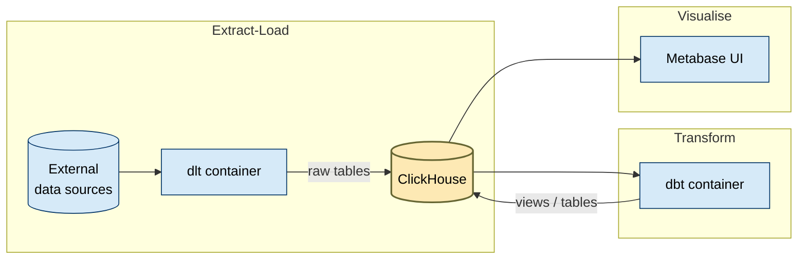
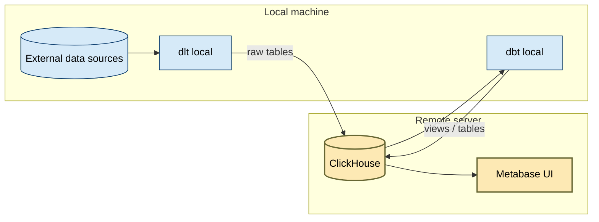

# 🚀 Bootcamp Modern Data Stack Architecture

This bootcamp uses a **lightweight Modern Data Stack (MDS)** to teach the **Extract → Load → Transform → Visualize** workflow on real datasets.

## Local Setup



## Remote Setup




## ⚙️ Components & Roles

| Layer             | Tool                 | Role in the Stack                                               |
| ----------------- | -------------------- | --------------------------------------------------------------- |
| **Ingestion**     | `dlt`                | Connectors for APIs, CSVs, scraping, DB; retries; deduplication |
| **Storage**       | `ClickHouse`         | Fast columnar OLAP warehouse; MergeTree engines for time-series |
| **Transform**     | `dbt`                | SQL models, schema tests, semantic layer (facts & dims)         |
| **Visualization** | `Metabase`           | Self-service BI dashboards                                      |
| **Source DB**     | `Postgres (Chinook)` | Example operational system for ingestion demo                   |

---
* **Sources**: Static CSV, Transactional Database, Timeseries API, Streaming API, Static API, Ecommerce Website, Other sources.
* **dlt (Extract & Load)**: Ingests data from multiple formats/APIs, applies light schema, pushes to warehouse.
* **ClickHouse (Warehouse)**: Stores data in efficient **MergeTree**/ **ReplacingMergeTree** tables with partitions (by date/region) for fast analytics.
* **dbt (Transform)**: Builds **staging → core → marts** models, runs tests (`unique`, `not_null`), and materializes facts/dimensions.
* **Metabase (Visualize)**: Queries the warehouse and builds dashboards (weather, BTC prices, reviews).


> **Note:** In production you’d add a data lake (e.g. S3/Delta Lake), data catalog (Amundsen/DataHub), security/Governance (RBAC, encryption, Ranger), orchestration (Airflow/Kubernetes), observability (Prometheus/Grafana), and data quality (Great Expectations). We’ve omitted those to focus on core ELT.

Above all, this bootcamp emphasizes **SQL** with only minimal Python, YAML, and Markdown.


---


## 🗄️ Modeling Conventions

* **dlt → raw layer**: Tables named `raw_*`, append/merge mode.
* **dbt → clean**: `dim_*` and `fct_*` models with tests.
* **dbt → marts**: Aggregations, rollups, and reporting views.
* **exploratory -> sandbox**: Discovery and temporary tables.

---

## 🔒 Security & Isolation

* Students connect with **`ftw_user`** (no `CREATE DATABASE`).
* Each student `_<alias>` to tables and names to avoid collisions.
* Secrets (API keys, passwords) are stored in **dlt secrets.toml** or `.env`.

---

## 📊 Example Pipelines

* `01_mpg.py` → UCI Auto MPG dataset
* `02_chinook.py` → Artists & Albums from Postgres
* `03_meteo_*` → Historical weather + PH regions + WMO codes
* `04_btc_markets.py` → CoinGecko Bitcoin prices
* `05_pokeapi_gen1.py` → Pokémon API (Gen 1)
* `06_lazada_scrape.py` → Lazada scraping (Playwright)
* `07_foodpanda.py` → Kaggle restaurant reviews

---

## ✅ Key Teaching Points

* How to ingest from **databases, APIs, CSVs, scrapers**.
* How **ClickHouse engines** affect deduplication, partitions, and performance.
* Why **dbt tests** matter (data quality + schema enforcement).
* How to isolate schemas/users for **multi-tenant teaching environments**.
* Building quick **dashboards** in Metabase from dbt models.

---

## 📌 Extensions (for production mindset)

* Add **orchestration** (Mage/Dagster/Airflow) to chain dlt → dbt → tests.
* Introduce **data contracts** (typed schemas, versioning).
* Enable **observability** (OpenLineage, Marquez, or dbt docs lineage).
* Apply **monitoring/alerts** on late data and API failures.

---

👉 This architecture balances **simplicity (bootcamp teaching)** with **modern practices** (idempotent loads, schema tests, semantic layers, partitioning). Learners get a hands-on feel for the modern data stack without the operational overhead of enterprise setups.
 

# FTW DE Bootcamp — Exercise Run Guide

This guide shows how to run each **extract → load (dlt)** and **transform (dbt)** exercise in your Docker setup. Commands assume you’re in the project root.

> **Quick tips**
>
> * Start the **core** stack once (ClickHouse + Metabase + Chinook Postgres) and leave it running.
> * Each exercise is: **run dlt → run dbt (in that exercise folder)**.
> * Local vs Remote: edit envs in `compose.yaml` as noted in each service block.

---

## 0) Start/Stop core services

```bash
# Start core (ClickHouse, Metabase, Chinook Postgres)
docker compose --profile core --compatibility up -d

# Check health
docker ps
# Metabase: http://localhost:3001 • ClickHouse HTTP: http://localhost:8123

# Stop everything (when done)
docker compose down
```

---

## How to reset docker containers

### stop Metabase only
docker compose stop metabase

### remove the metabase container and any anonymous volumes it owns
docker compose rm -f -s -v metabase

### find the actual named volume (compose prefixes it with the project name)
docker volume ls | grep metabase_data
#### e.g. myproject_metabase_data

## delete that named volume (this wipes metabase.db and all Metabase state)
docker volume rm <yourproject>_metabase_data

### bring Metabase back fresh
docker compose up -d metabase


---

## 01 — Auto MPG

**Extract & Load (dlt)**

```bash
docker compose --profile jobs run --rm \
  dlt python extract-loads/01-dlt-mpg-pipeline.py
```

**Transform (dbt)**

```bash
docker compose --profile jobs run --rm \
  -w /workdir/transforms/01_mpg \
  dbt build --profiles-dir . --target local
```

**Verify**

* In Metabase, add ClickHouse (if not added) and browse the `clean` / `mart` models for MPG.

---

## Did you encounter an ingestion error?
If for some reason the tables do not exist and throws an error, do the following:

### Option A — one-time manual create (safe, non-destructive)

Just create the DBs now and move on:

```bash
docker exec -it clickhouse clickhouse-client -q "
  CREATE DATABASE IF NOT EXISTS raw;
  CREATE DATABASE IF NOT EXISTS clean;
  CREATE DATABASE IF NOT EXISTS mart;
  CREATE DATABASE IF NOT EXISTS sandbox;
"
```

You can also run this via dbeaver.

### Option B — reinitialize the container (will wipe ClickHouse data)

If you actually want the entrypoint to re-run the init scripts (and you’re okay losing anything in `clickhouse_data`):

```bash
# Stop and remove containers + volumes for this compose project
docker compose down -v

# (Optional) double-check the volume is gone:
docker volume ls | grep clickhouse_data

# Bring it back up; first boot will now run init scripts
docker compose --compatibility up -d --profile core

# Verify
docker exec -it clickhouse clickhouse-client -q "SHOW DATABASES"
```

---

## 02 — Chinook (Postgres → ClickHouse)

> Chinook Postgres is prepared by `chinook_fetch` + `postgres_chinook` in the **core** profile.

**Extract & Load (dlt)**

```bash
docker compose --profile jobs run --rm \
  dlt python extract-loads/02-dlt-chinook-pipeline.py
```

**Transform (dbt)**

```bash
docker compose --profile jobs run --rm \
  -w /workdir/transforms/02_chinook \
  dbt build --profiles-dir . --target local
```

**Verify**

* Explore albums, artists, invoices in Metabase; confirm `stg_` views and `mart_` models appear.

---

## 03 — Weather (Meteo)

There are **three** loaders you can try:

* `03-dlt-meteo-pipeline.py` (base daily history)
* `03-dlt-xtra-meteo-ph-regions.py` (regional add-ons)
* `03-dlt-wmo-codes-pipeline.py` (lookup codes)

**Extract & Load (dlt)**

```bash
# Base
docker compose --profile jobs run --rm \
  dlt python extract-loads/03-dlt-meteo-pipeline.py

# Optional extras
docker compose --profile jobs run --rm \
  dlt python extract-loads/03-dlt-xtra-meteo-ph-regions.py

docker compose --profile jobs run --rm \
  dlt python extract-loads/03-dlt-wmo-codes-pipeline.py
```

**Transform (dbt)**

```bash
docker compose --profile jobs run --rm \
  -w /workdir/transforms/03_meteo \
  dbt build --profiles-dir . --target local
```

**Verify**

* Check cleaned daily temps/precip, join to WMO code lookups, and sample dashboards in Metabase.

---

## 04 — Bitcoin (BTC)

Note: make a non-scheduled version

**Extract & Load (dlt)**

```bash
docker compose --profile jobs run --rm \
  dlt python extract-loads/04-dlt-btc-pipeline.py
```

**Transform (dbt)**

```bash
docker compose --profile jobs run --rm \
  -w /workdir/transforms/04_btc \
  dbt build --profiles-dir . --target local
```

**Verify**

* Plot OHLC/close vs date in Metabase. Try simple moving averages in a SQL question.

---

## 05 — Pokémon

**Extract & Load (dlt)**

```bash
docker compose --profile jobs run --rm \
  dlt python extract-loads/05-dlt-poke-pipeline.py
```

**Transform (dbt)**

```bash
docker compose --profile jobs run --rm \
  -w /workdir/transforms/05_poke \
  dbt build --profiles-dir . --target local
```

**Verify**

* Browse Pokémon stats/models in Metabase; create a bar chart by type/avg attack.

---

## 06 — Lazada (sample dataset)

**Extract & Load (dlt)**

```bash
docker compose --profile jobs run --rm \
  dlt python extract-loads/06-dlt-laz-pipeline.py
```

**Transform (dbt)**

```bash
docker compose --profile jobs run --rm \
  -w /workdir/transforms/06_laz \
  dbt build --profiles-dir . --target local
```

**Verify**

* Build a price vs rating scatter, category leaders, top sellers, etc.

---

## 07 — Foodpanda Reviews (Optional)

**Extract & Load (dlt)**

```bash
docker compose --profile jobs run --rm \
  dlt python extract-loads/07-dlt-food-pipeline.py
```

**Transform (dbt)**

> ⚠️ Your snippet pointed dbt to `06_laz`. The correct path is **`07_foodpanda`**.

```bash
docker compose --profile jobs run --rm \
  -w /workdir/transforms/07_foodpanda \
  dbt build --profiles-dir . --target local
```

**Verify**

* Sentiment distributions, top restaurants by average rating and review volume.

---

## 08 — Unstructured (Optional)

**Extract & Load (dlt)**

```bash
docker compose --profile jobs run --rm \
  dlt python extract-loads/08-dlt-unstructured-pipeline.py
```

**Transform (dbt)**
(If you add a folder later under `dbt/transforms/08_unstructured`)

```bash
docker compose --profile jobs run --rm \
  -w /workdir/transforms/08_unstructured \
  dbt build --profiles-dir . --target local
```

---

## Remote Mode (students target a server)

1. On the **server** (teacher):

   ```bash
   docker compose --compatibility up -d --profile core
   # Ensure inbound ports 8123 (ClickHouse HTTP) and 3001 (Metabase) are open.
   ```
2. On **student** laptops:

   * In `compose.yaml`:

     * For **dlt**: set `DESTINATION__CLICKHOUSE__CREDENTIALS__HOST` to server IP/DNS
     * For **dbt**: set `CH_HOST` to server IP/DNS`
   * Then run the same **dlt** and **dbt** commands per exercise.

---

## Troubleshooting Cheatsheet

* **ClickHouse not ready**

  * Wait for healthcheck: `docker logs clickhouse`
* **Chinook loader not found**

  * Ensure `chinook_fetch` completed and `postgres_chinook` is healthy: `docker ps`

* **Metabase can’t see new tables**

  * In Admin → Databases → ClickHouse → **Sync** & **Re-scan field values**

---

## Clean Up

```bash
# Stop and remove containers (keep volumes)
docker compose down

# Nuke volumes (⚠️ deletes data)
docker compose down -v
```

That’s it—run dlt then dbt for each folder above, and explore your models in Metabase.
