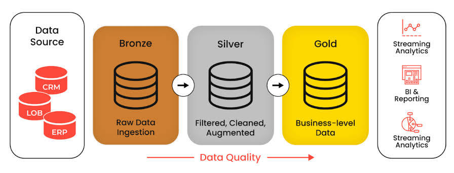
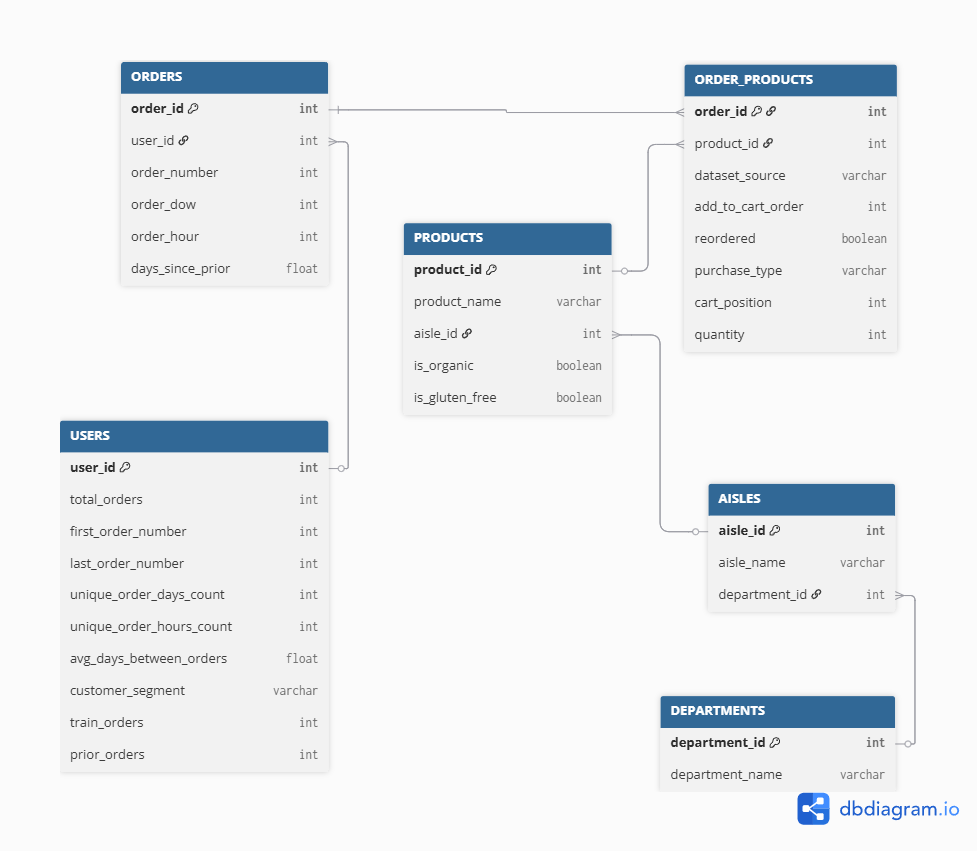
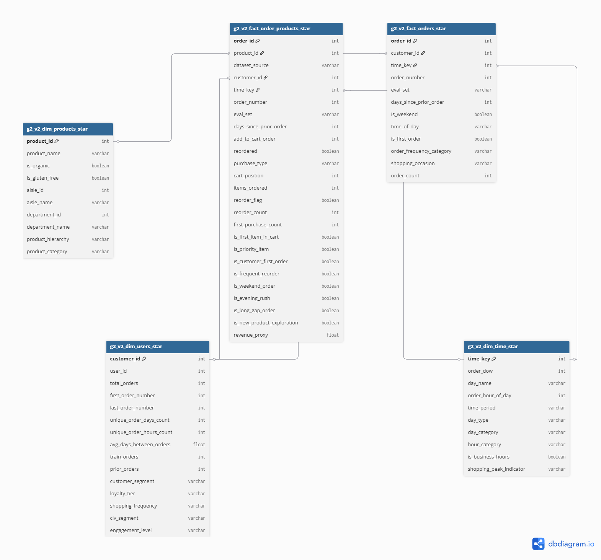

# 📝 Group 2 - Data Engineer Documentation & Presentation Guide

This guide documents the group's Instacart Basket Analysis (insta_churn) project and provides a presentation outline. Fill in details where appropriate and use the content for both internal documentation and final presentations.

---

## 1. Project Overview

- **Dataset Used:**  
  Instacart Market Basket dataset (Kaggle). Contains Orders, Order Products (prior/train), Products, Aisles, Departments, and sample Users metadata. The public dataset includes ~32M order-product rows across millions of orders.

- **Goal of the Exercise:**  
  Analyze customer purchasing behavior and product co‑occurrence to support churn analysis, recommendation strategies, and inventory optimization. Implement relational normalization (3NF), then produce a star schema for analytical queries and market-basket association rules.

- **Team Setup:**  
  Group project — members split responsibilities across ingestion (dlt), modelling (dbt clean & mart), analytics (SQL + itemset mining), and visualization (Metabase). Regular syncs and PR reviews were used to coordinate work.

- **Environment Setup:**  
  Dockerized development with ClickHouse as the analytics DB, dbt for transformations, dlt for extraction, and Metabase for visualization. Work performed on WSL2/Ubuntu and containerized services for reproducibility.

## 📊 Project Architecture Overview

```
┌─────────────────┐    ┌─────────────────┐    ┌─────────────────┐    ┌─────────────────┐
│   DATA SOURCE   │    │   EXTRACTION    │    │  TRANSFORMATION │    │   ANALYTICS     │
│                 │    │                 │    │                 │    │                 │
│ • Instacart CSV │───▶│ • dlt Pipeline  │───▶│ • dbt (3NF)     │───▶│ • Star Schema   │
│ • 6 Tables      │    │ • ClickHouse    │    │ • Normalization │    │ • Business KPIs │
│ • 36M Records   │    │ • Data Quality  │    │ • Data Cleaning │    │ • Churn Analysis│
└─────────────────┘    └─────────────────┘    └─────────────────┘    └─────────────────┘
```

---

## 2. Architecture & Workflow

- **Pipeline Flow:**  
  Raw CSVs → dlt ingestion → raw schema in ClickHouse (bronze) → dbt clean models (silver, 3NF) → dbt mart models (gold, star schema) → analytics models & DQ checks → Metabase dashboards

- **Tools Used:**  
  - Ingestion: `dlt`  Already Done by sir Myk.
  - Modeling: `dbt`  
  - Database: `ClickHouse` (docker)  
  - Visualization: `Metabase`  
  - Analysis / Scripting: Python (pandas, mlxtend or efficient Apriori implementations)

- **Medallion Architecture Application:**  
  - **Bronze (Raw):** dlt ingestion of CSV files into `raw` schema (preserve original columns).  
  - **Silver (Clean):** dbt models that enforce types, remove duplicates, and implement 3NF masters (products, aisles, departments, orders, order_products, users).  
  - **Gold (Mart):** denormalized star schema and analytics tables for fast BI and market-basket computations.



---

## 3. Modeling Process

- **Source Structure (Normalized):**  
  Raw files are already relational: products, aisles, departments, orders, order_products__prior/train. Keys: product_id, aisle_id, department_id, order_id, user_id. The clean layer casts types, deduplicates, and produces referentially consistent master tables.

  

- **Star Schema Design:**  
  - Fact Tables: FactOrderProducts (transaction-level), FactOrders (aggregated order metrics)  
  - Dimension Tables: DimProduct, DimCustomer, DimTime, DimAisle/DimDepartment (if needed)
  
  

- **Challenges / Tradeoffs:**  
  - Large volume of order-product rows (32M) requires careful materializations and potentially incremental models.  
  - Joining train + prior datasets requires consistent schema and provenance columns.  
  - Market-basket algorithms can be memory-heavy; use efficient, sampled, or partitioned approaches for Apriori.


---

## 4. Collaboration & Setup

- **Task Splitting:**  
  - dbt clean layer: implement 3NF tables and QA tests.  
  - dbt mart layer: build star schema and analytics models.  
  - Analytics & Itemset Mining: Python notebooks or jobs for Apriori and ranking.  
  - BI: Metabase dashboards and SQL cards.

- **Shared vs Local Work:**  
  Shared ClickHouse instance for integration tests; local dev via WSL and Docker Compose. Use Git branches and PRs to coordinate dbt and dlt changes. Keep `profiles.yml` and secrets out of git.

- **Best Practices Learned:**  
  - Keep raw data immutable; do cleaning in dbt.  
  - Use incremental dbt models for very large tables.  
  - Document sources and tests (dbt schema.yml).  
  - Use provenance columns (dataset_source) when unioning train/prior.

---

## 5. Business Questions & Insights

- **Business Questions Explored:**  
  1. Which products are most frequently bought together (top pairs / associations)?  
  2. Which customer segments exhibit high churn risk (based on recency/frequency/reorder patterns)?  
  3. What time-of-day / day-of-week patterns exist (peak shopping windows)?

- **Dashboards / Queries:**  
  - Metabase dashboards: Executive KPIs, Customer Churn Segments, Product Performance, Market Basket Associations.  
  - Key SQL snippets used: joins between order_products and products for aggregated metrics; RFM scoring queries; market-basket support/confidence/lift calculations (or precomputed Apriori outputs ingested into ClickHouse).
  - Public dashboard (visualization): https://ftw.dataengineering.ph/public/dashboard/783e319e-bf19-4d85-bef6-4f0d710ddfad

- **Key Insights:**  
  - Frequent co-purchase pairs reveal natural bundles — useful for recommendations.  
  - High churn-risk customers tend to show long recency and low reorder rates.  
  - Peak ordering hours and weekend vs weekday differences can guide marketing windows.

---

## 6. Key Learnings

- **Technical Learnings:**  
  - Designing 3NF as a foundation before building analytics marts reduces data anomalies.  
  - Incremental dbt models and materializations are important for scale.  
  - Itemset mining must be optimized (sampling, partitioning, or map-reduce style approaches) for large datasets.

- **Team Learnings:**  
  - Clear ownership of models and small PRs speed reviews.  
  - Document assumptions early (e.g., how to treat missing days_since_prior_order).

- **Real-World Connection:**  
  This exercise reflects common e-commerce workloads: large event streams, recommendation use-cases, and churn-prevention strategies.

---

## 7. Future Improvements

- **Next Steps with More Time:**  
  - Implement incremental dbt models with snapshots for slowly changing metrics.  
  - Move heavy Apriori runs off-line (Spark/Dask) and ingest results into ClickHouse.  
  - Add ML churn models and integrate outputs into BI for targeted campaigns.

- **Generalization:**  
  The same pipeline can power other retail datasets and be extended to real-time streams using Kafka and streaming frameworks.

---

## 📢 Presentation Tips

- Keep it **5–10 minutes** focusing on business impact and key technical choices.  
- Use **diagrams, sample SQL snippets, and visuals** from Metabase.  
- End with **learnings and next steps**.

---

## 🎯 Business Problem We're Solving

### Primary Question:
*"How can we reduce customer churn and optimize product placement through data-driven insights?"*

### What Makes This Project Valuable:
- **49,688 products** to analyze for performance trends
- **206,209 customers** to segment and retain
- **32.4M transactions** to mine for behavioral patterns
- **Rich behavioral data**: reorder rates, cart positions, time preferences

---